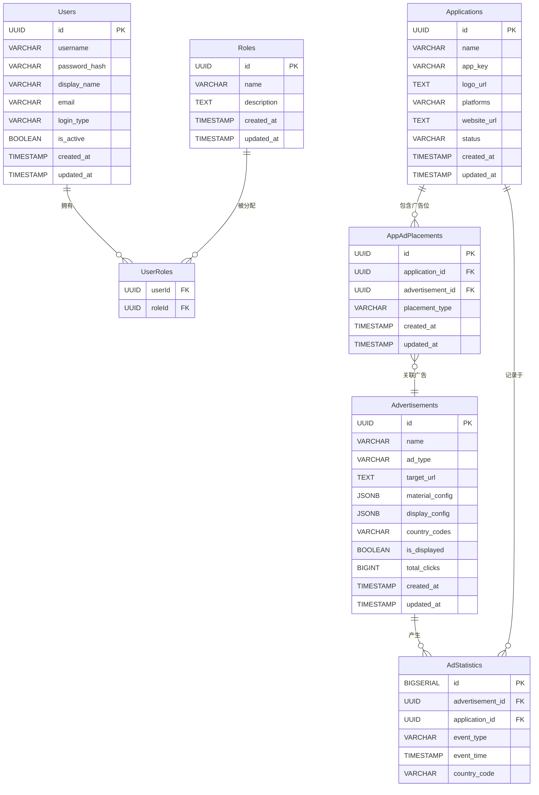

# 蓝鲸时代后台管理系统 - ER图

## 表字段说明

### Users (用户表)
- `id`: 用户ID (主键)
- `username`: 登录账号 (唯一)
- `password_hash`: 密码哈希
- `display_name`: 用户显示名称 (可选)
- `email`: 邮箱 (唯一, 可选)
- `login_type`: 登录类型 (默认 'password')
- `is_active`: 是否激活 (默认 TRUE)

### Roles (角色表)
- `id`: 角色ID (主键)
- `name`: 角色名 (唯一, e.g. super_admin, user)
- `description`: 描述 (可选)

### Applications (应用表)
- `id`: 应用ID (主键)
- `name`: 应用名称
- `app_key`: 应用唯一识别码 (唯一)
- `logo_url`: 应用Logo URL (可选)
- `platforms`: 应用终端数组 (如 ['iOS', 'Android'])
- `website_url`: 官网地址 (可选)
- `status`: 状态 (默认 'pending')

### AppAdPlacements (应用广告位表)
- `id`: 广告位ID (主键)
- `application_id`: 应用ID (外键)
- `advertisement_id`: 广告ID (外键)
- `placement_type`: 广告位类型 ('popup', 'banner', 'strip'等)

### Advertisements (广告表)
- `id`: 广告ID (主键)
- `name`: 广告名称
- `ad_type`: 广告类型 (如 popup_image, banner_multiple_image)
- `target_url`: 目标链接 (可空)
- `material_config`: 素材信息 JSON (存储素材URL、类型、尺寸等)
- `display_config`: 展示配置 JSON (多素材广告的配置信息)
- `country_codes`: 目标国家代码列表数组
- `is_displayed`: 是否展示 (默认 TRUE)
- `total_clicks`: 总点击量 (默认 0)

### AdStatistics (广告统计表)
- `id`: 统计记录ID (主键)
- `advertisement_id`: 广告ID (外键)
- `application_id`: 应用ID (外键)
- `event_type`: 事件类型 (如 'click', 'impression')
- `event_time`: 事件发生时间
- `country_code`: 国家代码 (可选)

## 说明

此ER图描述了蓝鲸时代后台管理系统的数据结构：

1. **用户 (Users)**: 存储系统用户信息，与角色表通过UserRoles关联
2. **角色 (Roles)**: 定义系统中的角色类型和权限
3. **应用 (Applications)**: 存储接入广告系统的应用信息
4. **应用广告位 (AppAdPlacements)**: 关联应用和广告，指定广告位类型
5. **广告 (Advertisements)**: 存储广告信息，包含素材配置和展示配置
   - 使用`material_config`字段以JSON格式直接存储素材信息（图片/视频URL、文件类型、尺寸等）
   - 使用`display_config`字段存储多素材广告的展示配置
6. **广告统计 (AdStatistics)**: 记录广告点击、曝光等统计事件

### 关系说明
- 用户和角色是多对多关系（通过UserRoles表）
- 应用和广告是多对多关系（通过AppAdPlacements表），一个应用可以有多个不同类型的广告位，每个广告位可以关联一个广告
- 广告和应用均可产生多个统计事件记录 